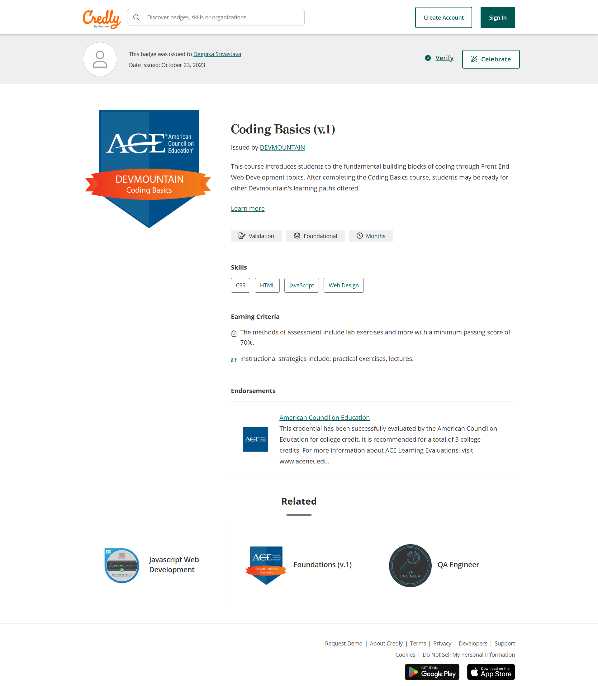

#  My Portfolio

## 🙋‍♀️ About Me
I’m a positive and motivated individual with a strong foundation in analytical thinking, developed through my academic background. I am highly organized, detail-oriented, and structured. I enjoy working with people and solving problems.
I hold a Master’s degree from Purvanchal University, India, and I’m currently transitioning into a career as a Software Automation Engineer. I’m actively building my skills through a combination of online and in-person courses, focusing on software testing tools, techniques, and hands-on practice with web applications designed for learning.
My goal is to apply this knowledge in real-world testing environments, gain practical experience, and grow into a mid-level software tester within the next two years.

## 📄 My Resume

[📄 Download My Resume](./Resume-qa.pdf.pdf)

## Certifications

### Software Quality Assurance Certification

##### Mountainland Technical College • Lehi, UT • January 2025 – May 2025

### Coding Basics Certification

#### DevMountain College • Lehi, UT• October 2023

[Credly Badge](https://www.credly.com/badges/80e69b37-75da-4a09-a23b-2b7efdf6b1ed/linked_in_profile)

## 🧠 Skills

### 🔍 Manual Testing
Performed manual functional and usability testing of web applications

Gained hands-on experience by testing educational project applications

### 📝 Test Planning
Understand the purpose and structure of test plans and test strategies

Familiar with outlining test objectives, scope, approach, and resource planning

### 🤖 Automation Tools
Hands-on experience with Selenium, Cypress, Appium, WebDriverIO, TestNG, Cucumber, and Mocha

Able to write and execute automated test scripts for web and mobile applications

Understand test automation frameworks

### 🔗 API Testing
Worked with REST APIs using Postman

Automated API tests using Rest Assured with Java

Validated HTTP methods, status codes, response bodies, headers, and authentication

Performed testing with POST, PUT, PATCH, DELETE using public APIs

### 🧮 SQL Databases
Can write complex queries using subqueries

Understand the difference between joins and unions

### ☕ Java Fundamentals
Able to write simple functions and basic algorithms

Use control structures like for and while loops

Read and understand Java code

### 🌐 JavaScript Fundamentals
Write basic functions and algorithms

Understand control structures

Read and understand simple JavaScript code

### 🌿 Version Control
Familiar with Git and common commands (clone, commit, push, pull, branch, merge)

Understand version control workflows and team collaboration using Git

### 🛠 Jira
Create and manage bug reports

Manage projects, assign tasks, and track progress with Jira boards

Familiar with Agile methodologies (Scrum)

### 🧰 IDEs and Tools
Eclipse for Java-based automation

VS Code for JavaScript and automation scripting

# Examples of my work

### CapstoneProjectLink 
  
   - https://github.com/Deepikavns/CapstoneProject

### Bug Report Screenshots

- [Bug #1: the screenshot of the bug report in Jira](images/screencapture-mtechqa-atlassian-net-browse-MTQA-2358-2025-04-30-18_46_06.png)
- [Bug #2: the screenshot of the bug report in Jira](images/screencapture-mtechqa-atlassian-net-browse-MTQA-2379-2025-04-30-18_41_56.png)
- [Bug #3: the screenshot of the bug report in Jira](images/screencapture-mtechqa-atlassian-net-browse-MTQA-2417-2025-04-30-18_44_34.png)
- [Bug #4: the screenshot of the bug report in Jira](images/screencapture-mtechqa-atlassian-net-browse-MTQA-2632-2025-04-30-18_51_20.png)

### API Testing Screenshots

- [API Testing #1: The screenshot of the API testing in Jira](images/screencapture-mtechqa-atlassian-net-jira-core-projects-MTQA-board-2025-04-30-19_01_54.png)
- [API Testing #1: The screenshot of the API testing in Jira](images/screencapture-mtechqa-atlassian-net-jira-core-projects-MTQA-board-2025-04-30-19_04_34.png)
- [API Testing #1: The screenshot of the API testing in Jira](images/screencapture-mtechqa-atlassian-net-jira-core-projects-MTQA-board-2025-04-30-19_09_57.png)

### 📫 Contact
Feel free to reach out via 

email - dsrivastavavns@gmail.com

linkedIn -https://www.linkedin.com/in/deepika-srivastava-93072a28a/ 

Thank you for visiting my portfolio!
